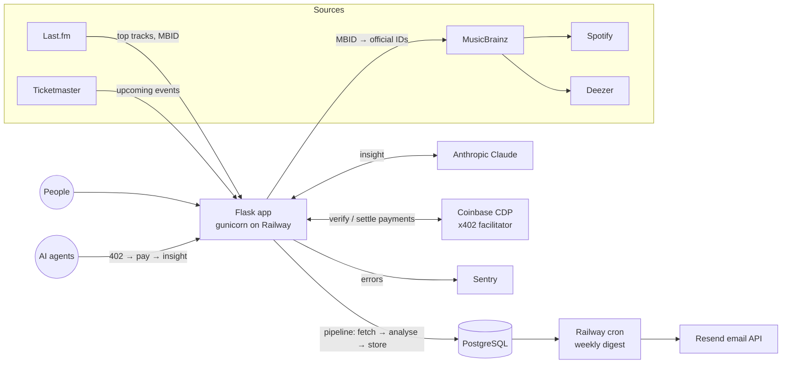

# Waveline — music data platform

[](https://github.com/dimopapa91/music-insight-pipeline/actions/workflows/ci.yml)

**Live:** [wearewaveline.com](https://wearewaveline.com)

Waveline is a live, production-deployed music data platform. A Python ETL pipeline pulls
listening data from Last.fm, resolves each artist's identity across Spotify, Deezer and
MusicBrainz, enriches it with AI-written analysis (Anthropic Claude), and stores it in
PostgreSQL. A Flask web app serves it to people (artist pages, comparisons, a community
feed) and to AI agents, through a pay-per-request API settled in USDC on Base via
[x402](docs/x402.md).

## Highlights

- **ETL pipeline with identity resolution.** Artist data from five external APIs. Artist
  identity is anchored on the MusicBrainz ID (MBID) rather than the name, so two artists
  who share a name don't get each other's photos and stats. Name-only lookups (e.g.
  Ticketmaster events) go through a strict name-match guard that rejects tribute acts.
- **Resilient AI enrichment.** If the Claude call fails, the search still succeeds and the
  page falls back to the most recent good insight. AI text is post-processed
  deterministically (e.g. em dashes stripped) before it is stored or served.
- **A paid API for AI agents, live on mainnet.** `GET /api/insight?artist=<name>` answers
  with HTTP 402 and a price (0.005 USDC). The agent pays, and the payment is settled
  through Coinbase's CDP facilitator only when the response succeeds. Unknown artists,
  bad input and database errors are never charged. First real payment on Base mainnet:
  [`0xdf63c126…40e3`](https://basescan.org/tx/0xdf63c126565fbc83a5aa1f5deb575c8f1757cc3a35a0871aff20f54d0ef740e3).
  Checked end to end from outside by [nsgoods](https://x402.nsgoods.org). Details:
  [docs/x402.md](docs/x402.md).
- **Production operations.** gunicorn (2 workers × 4 threads) on Railway with a
  healthcheck, a separate Railway cron service for the weekly email digest, Sentry error
  monitoring tagged per release, rate limiting, and TTL caches on external calls
  (homepage time-to-first-byte went from ~5 s to ~0.25 s).
- **Cost and abuse controls.** Crawlable URLs (`/artist/…`, `/compare`) never run the
  paid pipeline or a Claude call for anonymous visitors, searches are rate-limited, and
  the agent API only serves insights that already exist.
- **Tested.** ~780 pytest tests run in GitHub Actions on every pull request. The test
  configuration pins the database URL and third-party keys to dummy values, so a test run
  can't reach production. The payment and configuration safety rules were
  mutation-checked: removing any of them makes a test fail.
- **Privacy-respecting analytics.** Self-hosted page-view analytics with no third-party
  tracker and no stored IP addresses (see [Analytics](#analytics)).

## Architecture



## Features

**Music data.** Artist search with Last.fm top tracks and a Claude-written insight ·
artist pages with photo, listeners, scrobbles, Deezer fans, tags, similar artists and
upcoming events with ticket links · 30-second previews in a floating player ·
head-to-head artist comparison with an AI verdict · a personal taste profile written by
Claude · music news (RSS: Pitchfork, NME, The Guardian, Resident Advisor) and a Deezer
albums chart.

**Community.** Accounts (Flask-Login, hashed passwords) · public profiles with avatar and
cover uploads (Cloudinary) · a Following/Discover feed with posts, likes and comments ·
notifications · people discovery ranked by musical taste · private one-to-one messaging.

**For agents.** The x402 paid endpoint above, plus a free preview at
`/api/insight/preview` and discovery metadata for Coinbase's x402 Bazaar catalogue.

## Tech stack

| Area | Technology |
|------|------------|
| Backend | Python 3.10, Flask 3 (blueprints), gunicorn |
| Data | PostgreSQL (JSONB), psycopg2 |
| Data sources | Last.fm, MusicBrainz, Spotify, Deezer, Ticketmaster Discovery, RSS |
| AI | Anthropic Claude (Haiku) |
| Payments for agents | x402 (Python SDK 2.24), Coinbase CDP facilitator, USDC on Base |
| Infrastructure | Railway (web service, cron service, PostgreSQL), custom domain |
| Other services | Cloudinary (images), Resend (email), MaxMind GeoLite2 (country analytics) |
| Monitoring | Sentry (errors, per-release tagging) |
| Quality | pytest, GitHub Actions CI, Flask-Limiter |

## Project structure

```
dashboard.py         App entry point: config, login, filters, blueprint wiring (gunicorn dashboard:app)
pipeline.py          ETL: Last.fm fetch → Claude analysis → PostgreSQL
services.py          Shared data clients (Last.fm, MusicBrainz, Spotify, Deezer, Ticketmaster, RSS) + caches
agent_api.py         x402 paid API for agents (/api/insight, /api/insight/preview)
views_*.py           Blueprints: main, artist, taste, news, feed, discover, messages, notifications, admin
auth.py, profiles.py Accounts, public profiles, settings, follows
social.py            Posts, likes, comments, follows, notifications (data layer)
messaging.py         Private messaging (data layer)
analytics.py         Self-hosted analytics: request recorder, GeoIP, stats queries
models.py, db.py     Schema init/migrations, PostgreSQL connection helper
email_digest.py      Weekly HTML digest (run by the Railway cron service)
text_clean.py        Deterministic clean-up of AI-generated text
rate_limit.py        Shared Flask-Limiter instance
image_storage.py     Cloudinary uploads
transform.py, genre_trends.py, main.py   Stand-alone reports and CLI pipeline run
scripts/             One-off maintenance scripts + the x402 test-payment client
docs/x402.md         How the agent API works, with verifiable transactions
tests/               pytest suite (conftest.py pins env vars so tests never reach real services)
.github/workflows/   CI: runs the full suite on every push and pull request
```

## Running it locally

```bash
git clone https://github.com/dimopapa91/music-insight-pipeline.git
cd music-insight-pipeline
python3 -m venv venv && source venv/bin/activate
pip install -r requirements-dev.txt
```

Create the database and the one table the app expects to exist (everything else is
created or migrated automatically on startup by `models.init_db()`):

```sql
CREATE TABLE searches (
    id SERIAL PRIMARY KEY,
    artist_name VARCHAR(255) NOT NULL,
    top_tracks JSONB NOT NULL,
    claude_insight TEXT NOT NULL,
    searched_at TIMESTAMP DEFAULT CURRENT_TIMESTAMP
);
```

`.env` (never committed):

```
DATABASE_URL=postgresql://localhost/music_insights
SECRET_KEY=change-me
LASTFM_API_KEY=...
ANTHROPIC_API_KEY=...
SPOTIFY_CLIENT_ID=...
SPOTIFY_CLIENT_SECRET=...

# Optional
TICKETMASTER_API_KEY=...        # upcoming events on artist pages
CLOUDINARY_URL=...              # avatar/cover uploads
SENTRY_DSN=...                  # error monitoring
ADMIN_USERNAME=...              # who can see /admin/stats
GEOIP_LICENSE_KEY=...           # country analytics (or GEOIP_DB_PATH)
DIGEST_EMAIL_FROM=... DIGEST_EMAIL_TO=... RESEND_API_KEY=...   # weekly digest

# Optional: x402 agent API (off unless X402_PAY_TO is set; testnet by default)
X402_PAY_TO=0x...               # public receiving address only
X402_NETWORK=eip155:84532       # eip155:8453 for Base mainnet
X402_FACILITATOR=x402org        # or cdp, with CDP_API_KEY_ID / CDP_API_KEY_SECRET
```

```bash
python3 dashboard.py            # dev server on http://localhost:5000
pytest                          # full test suite
python3 email_digest.py         # send the weekly digest once
```

In production the app runs as
`gunicorn dashboard:app --bind 0.0.0.0:$PORT --workers 2 --threads 4 --timeout 120`
(Railway start command) with `/robots.txt` as the healthcheck, and the digest runs from a
separate Railway cron service (`python email_digest.py`, Mondays 08:00 UTC).

## Main routes

| Route | Description |
|-------|-------------|
| `/` | Dashboard: search, stats, recent insights, community |
| `/artist/<name>` | Artist page (multi-source data, AI insight, events) |
| `/compare?a=X&b=Y` | Head-to-head comparison |
| `/profile` | Your taste profile |
| `/news` | Music news and albums chart |
| `/feed`, `/discover`, `/messages`, `/notifications` | Community (login required for posting/messaging) |
| `/u/<username>`, `/settings` | Public profiles and profile settings |
| `/api/insight?artist=<name>` | x402 paid API for agents (see [docs/x402.md](docs/x402.md)) |
| `/api/insight/preview` | Free sample of the agent API response |
| `/api/stats`, `/api/artists` | Public JSON stats |
| `/admin/stats` | Owner-only analytics (404 for everyone else) |

## Analytics

Waveline records a lightweight, **self-hosted** page-view log: no third-party analytics
and no client-side tracking script. An `after_request` hook (`analytics.py`) stores one
row per real HTML page view; static files, JSON APIs, the admin area and non-GET
requests are skipped.

No raw IP address is ever stored. The visitor identifier is
`sha256(ip + date + user_agent + SECRET_KEY)`, truncated, so it **rotates every UTC day**
and is never a durable identifier. Aggregates (page views, unique visitors, top countries,
pages and referrers, sign-ups, searches, community activity) are visible at `/admin/stats`
only to the user named in `ADMIN_USERNAME`.

Country breakdowns use MaxMind GeoLite2: set `GEOIP_LICENSE_KEY` and the database is
downloaded on startup, or point `GEOIP_DB_PATH` at a local `.mmdb` file. Without either,
analytics still work and `country` is recorded as `NULL`.

---

Built by [Dimos Dimitrios Papageorgiou](https://www.linkedin.com/in/dimos-dimitrios-papageorgiou/)
([GitHub](https://github.com/dimopapa91)), Manchester, UK.
